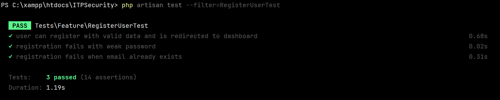
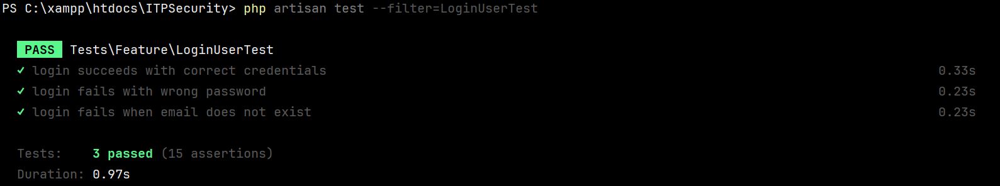

# Testing

## User Story 1: Registreren voor persoonlijke dashboard

### Paths

**Happy path:**  
Gegeven: de gebruiker wil zichzelf registreren op de website  
Wanneer: de gebruiker zijn gewenste gebruikersnaam, email-adres en wachtwoord invoert, en deze voldoen allemaal aan de eisen  
Dan: de gebruiker krijgt toegang tot zijn persoonlijke dashboard en is nu geregistreerd

**Unhappy path 1: zwak wachtwoord**  
Gegeven: de gebruiker wil zichzelf registreren op de website  
Wanneer: de gebruiker zijn gewenste gebruikersnaam, email-adres en wachtwoord invoert  
Dan: de gebruiker krijgt een melding dat zijn wachtwoord niet voldoet aan de eisen en dus een ander wachtwoord moet bedenken

**Unhappy path 2: email al in gebruik**  
Gegeven: de gebruiker wil zichzelf registreren op de website  
Wanneer: de gebruiker zijn gewenste gebruikersnaam, email-adres en wachtwoord invoert, maar het email-adres is al in gebruik  
Dan: de gebruiker krijgt een melding dat het gewenste email-adres al in gebruik is, wat betekent dat hij een ander email-adres moet kiezen

### Tests

**Systeemtests:**
1. Test of de registratie lukt met geldige gegevens (happy path)
2. Test of de registratie faalt met een zwak wachtwoord (unhappy path)
3. Test of de registratie faalt als het email-adres al in gebruik is (unhappy path)

**Unit tests:**
1. Test of de password validator alleen sterke wachtwoorden accepteert
2. Test of de gebruiker wordt aangemaakt met een email-adres dat nog niet in gebruik is

### Evaluatie

**Mogelijke fout die wel wordt gevonden:**  
De tests ontdekken wanneer een wachtwoord te zwak is en niet voldoet aan de eisen of wanneer een email-adres al in gebruik is

**Mogelijke fout die niet gevonden kan worden:**  
De tests kunnen niet zien wat er gebeurt als 2 gebruikers met dezelfde gegevens registreren, wanneer er problemen zijn met de database, of wanneer speciale tekens worden gebruikt en verwerkt

**Conclusie:**  
De tests bevestigen dat de registratie met correcte gegevens goed werkt en ongeldige invoer met zwakke wachtwoorden en email-adressen in gebruik tegengaat. Niet alle fouten kunnen gevonden worden omdat deze buiten de basisfunctionaliteit vallen

---

## User Story 2: Inloggen na registratie

### Paths

**Happy path:**  
Gegeven: de gebruiker heeft zich geregistreerd en wil nu inloggen op het geregistreerde account  
Wanneer: de gebruiker voert hun email-adres en wachtwoord in  
Dan: de gebruiker wordt ingelogd en doorgestuurd naar het dashboard

**Unhappy path 1:**  
Gegeven: de gebruiker heeft zich geregistreerd en wil nu inloggen op het geregistreerde account  
Wanneer: de gebruiker voert hun email-adres en wachtwoord in, maar het wachtwoord komt niet overeen met hun email-adres  
Dan: de gebruiker wordt niet ingelogd en krijgt een foutmelding dat de gegevens niet overeenkomen met die in het systeem

**Unhappy path 2:**  
Gegeven: de gebruiker heeft zich geregistreerd en wil nu inloggen op het geregistreerde account  
Wanneer: de gebruiker voert hun email-adres en wachtwoord in, maar het ingevoerde email-adres bestaat niet  
Dan: er wordt geprobeerd in te loggen, maar dit gebeurt niet omdat de gegevens niet kloppen

### Tests

**Systeemtests:**
1. Test of inloggen lukt als de gebruiker zijn gegevens goed invoert (happy path)
2. Test of inloggen faalt als het wachtwoord niet overeenkomt met het email-adres (unhappy path)
3. Test of inloggen faalt als het email-adres niet bestaat (unhappy path)

**Unit tests:**
1. Test of het systeem het juiste wachtwoord valideert voor een bestaand account
2. Test of het systeem een foutmelding geeft als een email-adres niet in de database staat

### Evaluatie

**Mogelijke fout die wel wordt gevonden:**  
De tests detecteren of inloggen faalt als de gebruiker een verkeerd wachtwoord of een niet-bestaand email-adres invoert

**Mogelijke fout die niet gevonden kan worden:**  
De tests controleren niet of de gebruiker op de juiste manier wordt doorgestuurd naar het dashboard na het inloggen en of het systeem de gebruiker tijdelijk blokkeert na meerdere mislukte pogingen

**Conclusie:**  
De tests laten zien dat het inloggen met goede of foute gegevens correct wordt afgehandeld. De tests laten zien dat de basisfunctionaliteit goed werkt. Toch blijven er altijd risico’s rond beveiliging en gebruikerservaring na de tests, zoals brute force-bescherming en of je wel op de dashboard pagina komt na het inloggen, dit wordt niet getest.

---

screenshots te vindein in de map `screenshots`
README.md is het testplan onderdeel van testing